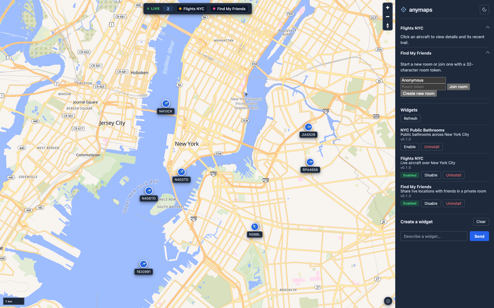

# anymaps

**Runner-up — Rho Lock In Hackathon, Fall 2026.**

A customizable map web application. Users add *widgets* — small, self-contained
extensions that draw live or static data on a shared map. Each widget is one
JSON manifest plus one JavaScript bundle. No server code.



*Live aircraft over New York City, with the widget gallery and the AI wizard
sidebar.*

## What it is

anymaps is an SDK and a backend that make map widgets cheap to build. A widget
declares its data source in a manifest, ships a small bundle, and draws on the
map only through the `anymaps` SDK. The product is the SDK; the demo widgets
prove it works.

Three demo widgets ship in `widgets/`:

- **Flights NYC** — live aircraft over New York from ADSB.lol. Markers move,
  rotate with heading, and interpolate between polls. Click a plane to see its
  details and recent trail.
- **Find My Friends** — share live locations in a private room. Two browsers
  join by a room token and see each other move.
- **NYC Public Bathrooms** — static public bathrooms from OpenStreetMap Overpass.

## Highlights

- **AI wizard.** Describe a widget in plain English. The Agent Service asks
  clarifying questions, verifies the data source, then generates a manifest and
  bundle, publishes them, and the client installs and enables the result
  automatically.
- **Real-time flights.** The flights widget polls every five seconds and
  interpolates marker positions between polls, so planes glide instead of jump.
  It draws each selected plane's trail from the server's series cache.
- **Isolated widgets.** Each widget runs in its own Web Worker. It cannot touch
  the map, the DOM, `window`, or storage. Everything crosses a typed
  command/event boundary.
- **Private rooms.** Private channel data is scoped to a capability token. A
  128-bit room token is the whole access boundary.
- **SSRF-safe fetching.** The server and the agent fetch external sources only
  over HTTPS and reject private and loopback IP ranges.

## How it works

```
Map Client (browser)
 ├─ WidgetManager ── owns map, DOM, registry, workers, camera, geolocation
 │    ├─ MapLibre GL JS ── renderer
 │    ├─ anymaps SDK ── typed command/event boundary
 │    └─ Wizard panel ── built-in chat UI
 └─ Widget workers ── one Web Worker per enabled widget

Generic Widget Server (FastAPI + SQLite)
 ├─ Registry ── publish, gallery, install
 ├─ Channels ── reads/writes, filtering, caching
 ├─ Poller ── fetches external sources on their interval
 └─ Secrets ── server-side API key store, referenced by ID

Agent Service (Python + DeepSeek LLM)
 ├─ Wizard API ── natural language in, generated widget out
 ├─ Source test ── verifies a candidate source under the SSRF rules
 └─ Generator ── writes manifest + bundle, publishes via POST /widgets
```

Three rules shape the whole system:

1. A widget never touches the map or DOM directly. It speaks only through the
   SDK.
2. The server never transforms data. It fetches, caches, filters, and
   broadcasts. All processing happens in the widget.
3. One widget = one manifest + one bundle + a declarative data config. No
   server code.

## Tech stack

- **Client** — Vite, vanilla JavaScript, MapLibre GL JS. Widgets run in Web
  Workers.
- **Server** — FastAPI, SQLite, httpx, JSON Schema validation.
- **Agent** — Python, DeepSeek LLM, Serper web search, shared SSRF rules.
- **Deployment** — Docker Compose, two services.

## Quick start

Client:

```sh
cd client
npm install
npm run dev      # http://localhost:5173
```

Server and agent, from the repo root:

```sh
python3 -m venv .venv
source .venv/bin/activate
pip install -r server/requirements.txt -r agent/requirements.txt -r server/requirements-dev.txt
uvicorn server.app.main:app --reload --port 8000
uvicorn agent.app.main:app --reload --port 8001 --env-file .env
```

The agent reads `WIZARD_LLM_API_KEY` from the environment. Load it with
`--env-file .env`, or export it in your shell.

Seed the demo widgets:

```sh
python scripts/seed.py
```

Or both services with Docker:

```sh
cp .env.example .env   # fill WIZARD_LLM_API_KEY for the wizard
docker compose up --build
```

## Tests

```sh
source .venv/bin/activate
pytest                 # server, agent, and shared tests
```

```sh
cd client
npm test               # node --test
npm run build
```

## Repository layout

- `client/` — map client, WidgetManager, the `anymaps` SDK, gallery and wizard UI.
- `server/` — generic widget server plus registry. FastAPI + SQLite.
- `agent/` — Agent Service, the wizard backend.
- `shared/` — SSRF rules and manifest schema loader, shared by server and agent.
- `contracts/` — `manifest.schema.json`, frozen.
- `widgets/` — the three demo widgets.
- `scripts/seed.py` — publishes the demo widgets to a running server.
- `docs/demo.md` — the rehearsal script for the three demos.

## Documentation

- `SPEC.md` — the system specification and the locked decisions.
- `CONTRACTS.md` — the authoritative wire contract.
- `PLAN.md` — team split, timeline, and cut order.
- `client/README.md` — the widget authoring guide and SDK reference.
